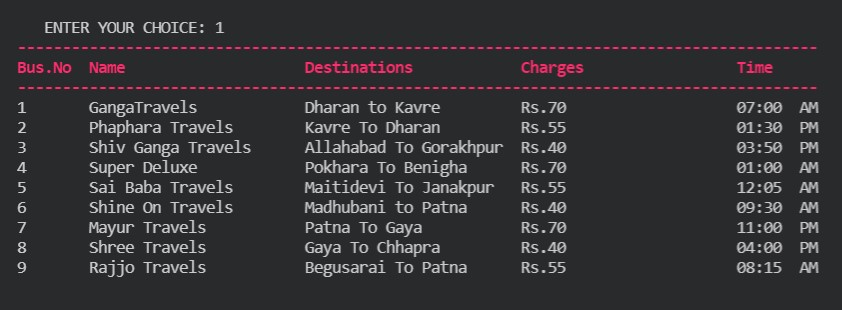
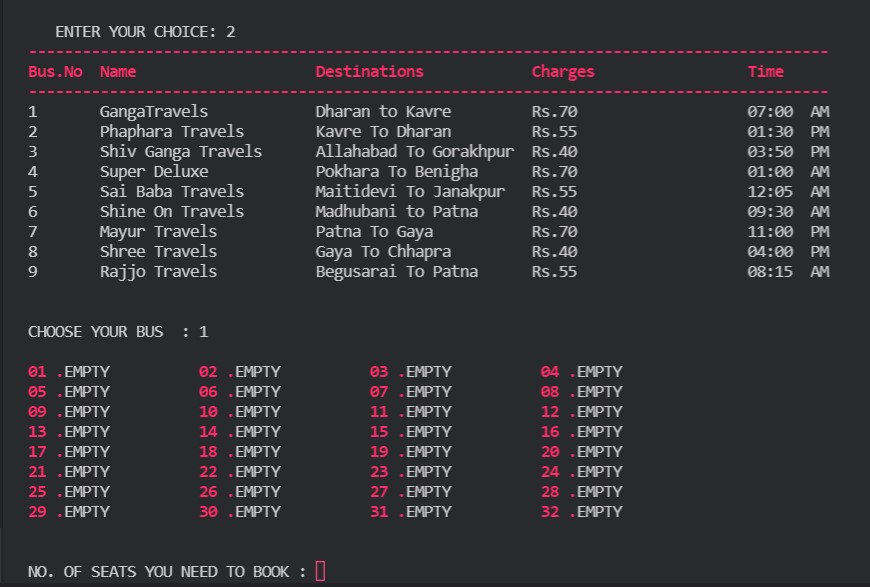
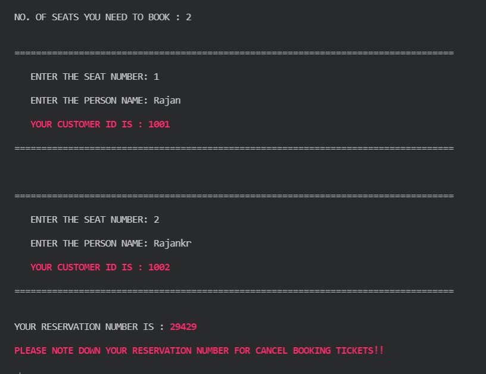
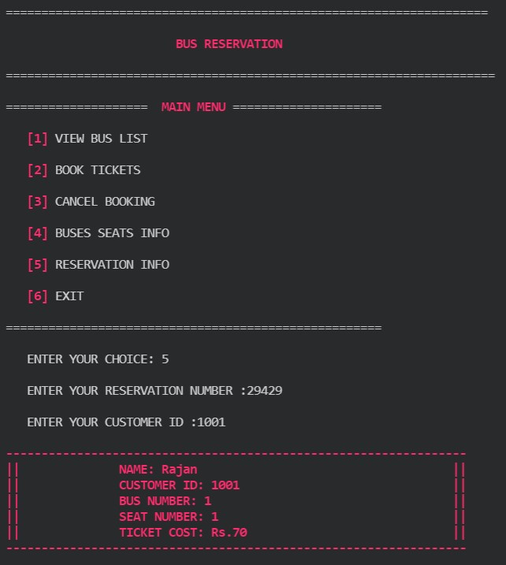

# Bus Reservation System using c language

## Building & running
> `make all`  

## HERE ARE FEW SNAPSHOTS OF OUTPUTS

 
 

 
 

 
 

 
 

 
 

Folder             | Description
-------------------| -----------------------------------------
`0_Certificates`   | Certicates of courses
`1_Requirements`   | Documents detailing requirements and research
`2_Design`         | Documents specifying design details
`3_Implementation` | All code and documentation
`4_Test_plan`      | Documents with test plans and procedures

